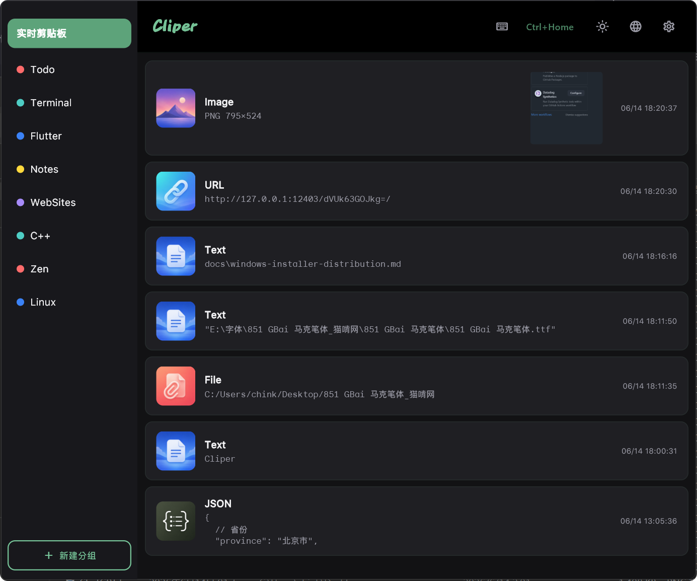

# CLIPER

Clipboard history manager for Windows and macOS. Never lose anything you copied — search, organize, and reuse with ease.

## What is CLIPER?

CLIPER lives in your system tray and pops up a floating panel when you need it. Everything you copy — text, links, images, files — is automatically recorded and instantly searchable.

## How to use

1. **Install** — run the installer; CLIPER starts automatically.
2. **Copy anything** — text, images, URLs, files. CLIPER saves them all.
3. **Open the panel** — press the global shortcut (default: `Alt+Shift+V`).
4. **Find and paste** — scroll through history or type to search. Double-click any item to copy it back.
5. **Organize** — create groups and drag items into collections to keep related content together.
6. **Hide** — the panel hides automatically when you click away.

## Download

Prebuilt installers are published on the [Releases](https://github.com/xiehanff/cliper/releases) page — grab `CLIPER_Setup_<version>.exe` (Windows) or `cliper-<version>.dmg` (macOS). Pushing a `v*` tag rebuilds both platforms and publishes the release via [GitHub Actions](https://github.com/xiehanff/cliper/actions/workflows/build-desktop-packages.yml), with notes taken from `CHANGELOG.md`.

## Features

- **Unified history** — text, links, images, and files in one chronological timeline.
- **Instant search** — filter across all content types as you type.
- **Custom groups** — create, rename, reorder, and color-code groups. Drag items between groups.
- **Global shortcut** — customizable hotkey to show/hide the panel.
- **Dark & light themes** — switch anytime.
- **Multi-language** — English and Chinese (中文).
- **Lightweight** — runs in the system tray. No window chrome, no taskbar entry.
- **Privacy-first** — all data stays local. No accounts, no cloud, no telemetry.

---

[**中文版**](#)

*CLIPER. Copy. Find. Paste.*
